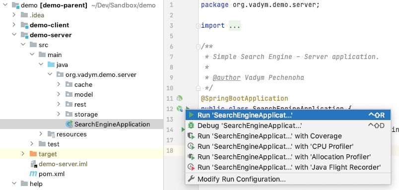
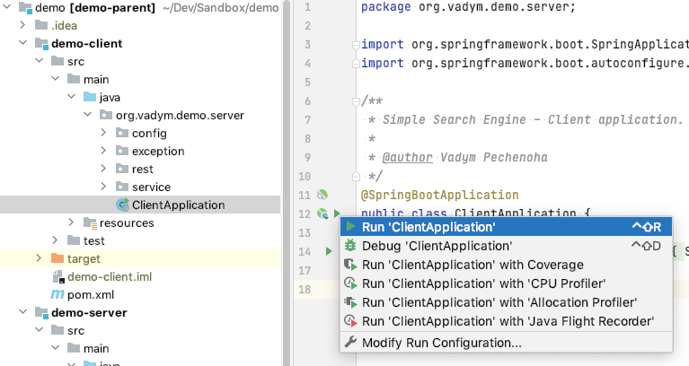
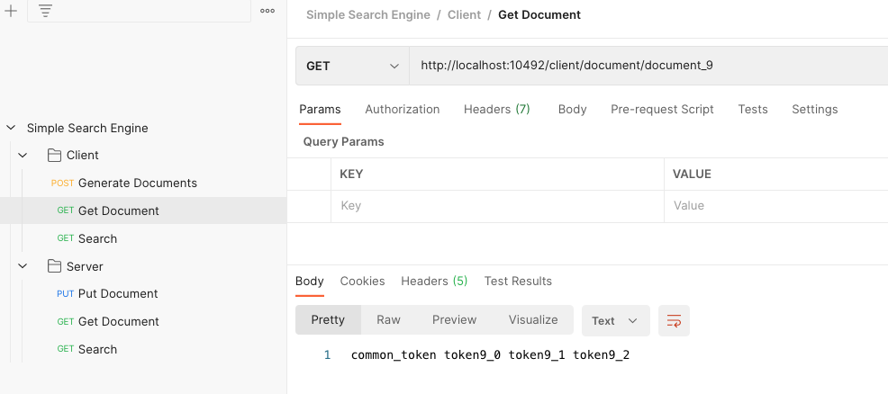

# Simple Search Engine

## Overview
This is a demo project representing Simple Search Engine system. The project consists of two modules:
- server application
- client application

Both modules are present in form of Spring Boot web applications.

## How to run

There are multiple ways of running the applications.
The applications will be launched on the following ports:
- server: `10491`
- client: `10492`

### 1. The simplest way (via `Docker` / `docker-compose`)
If you have a Unix-like operating system, the applications could be launched via a single command line (shell-script). The shell-script builds Docker images for the applications, launches them and exposes the ports via docker-compose.

```bash
# to make the script executable
chmod +x ./start.sh

./start.sh
```

### 2. From the IDE
The apllications could be launched from the IDE. No additional parameters, configs are needed, just press the "Play" button for two classes: `SearchEngineApplication` (server) and `ClientApplication` (client).

Screenshots from the IntelliJ IDEA:





## How to use

### Via Postman
The corresponding Postman collection can be imported and used in order to verify the API of both applications: client and server.

`Postman -> File -> Import...`

[Postman Collection](help/postman/SimpleSearchEngine.postman_collection.json)

After the import, it will look this way:


### Via `curl`

#### Server Application

- Add document
```bash
curl --request PUT 'http://localhost:10491/document/hello' \
--header 'Content-Type: application/json' \
--data-raw '{
    "contents": "hello 123 world 456"
}'
```

- Retrieve document contents
```bash
curl --request GET 'http://localhost:10491/document/hello'
```

- Search
```bash
curl --request GET 'http://localhost:10491/search?query=123%20hello'
```

#### Client Application

- Generate a bunch of documents
```bash
curl --request POST 'http://localhost:10492/client/documents?from=0&size=20'
```

- Retrieve document contents
```bash
curl --request GET 'http://localhost:10492/client/document/document_9'
```

- Search
```bash
curl --request GET 'http://localhost:10492/client/search?query=common_token%20token19_0'
```
